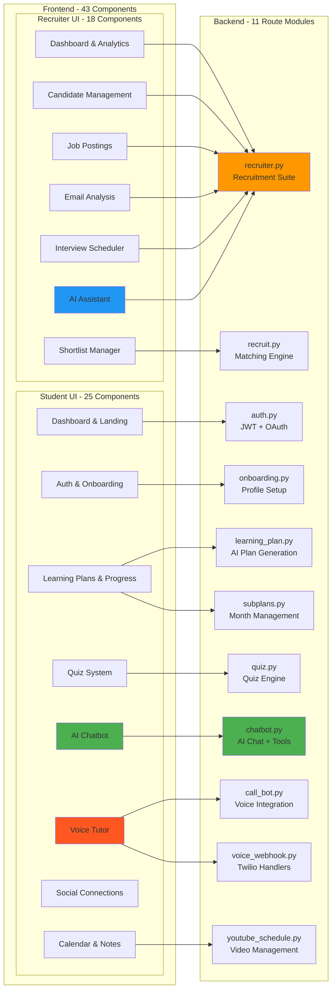
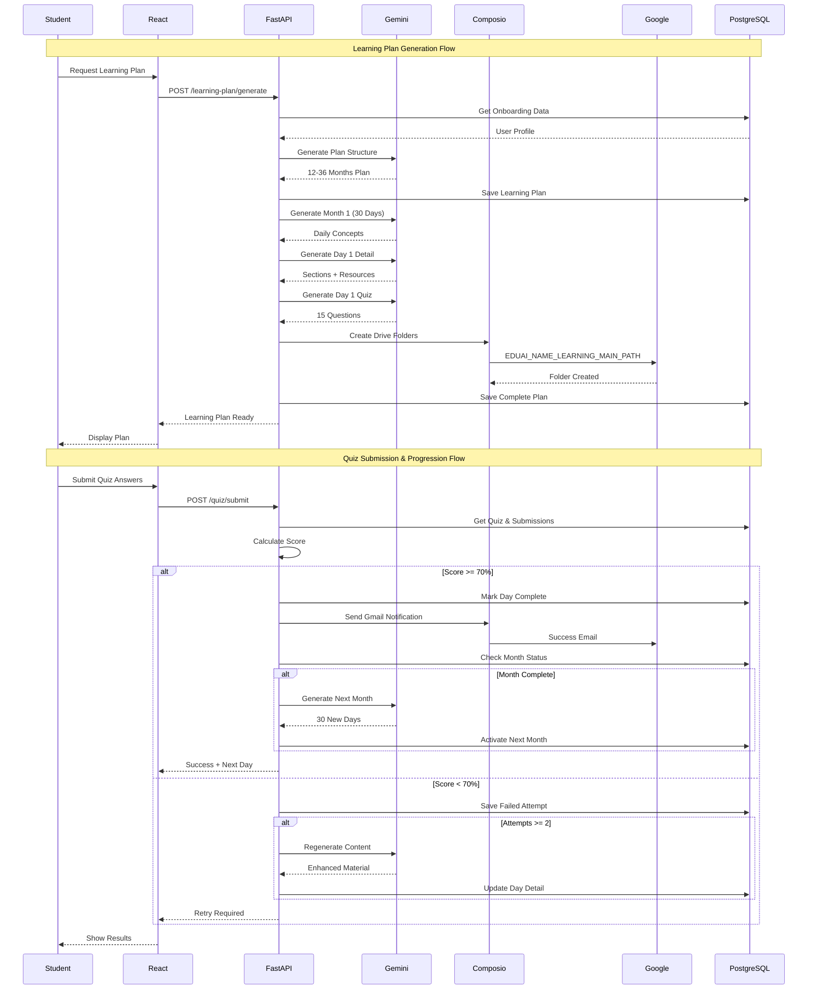
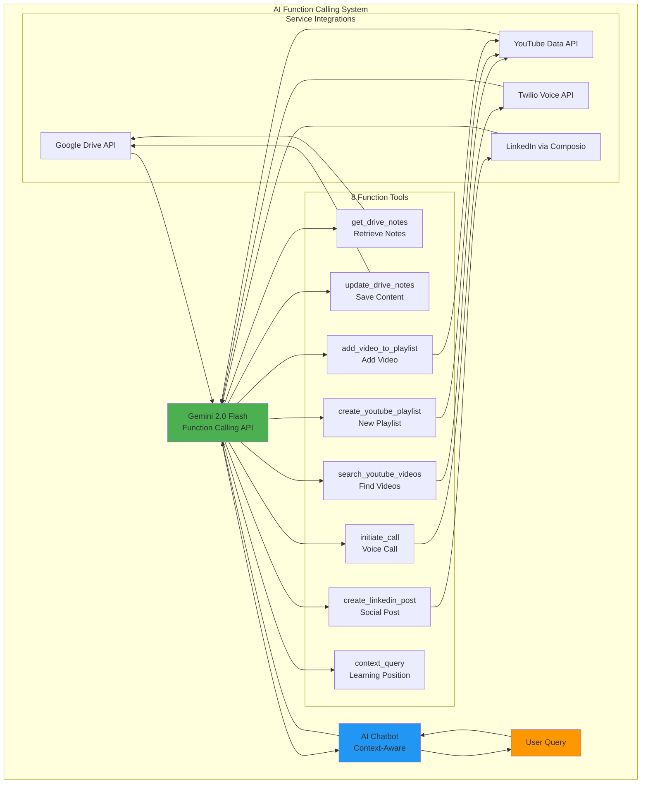
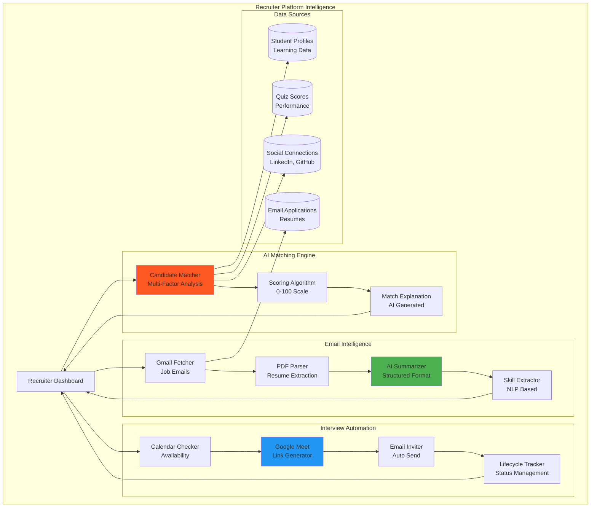

# 🎓 EduAI - Next-Generation AI Learning & Recruitment Ecosystem

<div align="center">


**Revolutionary AI-powered dual-platform bridging personalized education with intelligent talent acquisition**

[Architecture](#-system-architecture) • [Features](#-core-capabilities) • [Tech Stack](#-technology-ecosystem) • [Installation](#-quick-start) • [API](#-api-reference)

</div>

---

## 🌟 Platform Overview

EduAI is a comprehensive dual-user ecosystem that revolutionizes both learning and recruitment through advanced AI integration:

- **For Students**: AI-generated personalized learning paths with 30-day monthly structures, adaptive quizzes, voice tutoring, and automated progress tracking
- **For Recruiters**: Intelligent candidate matching, AI-powered email analysis, automated interview scheduling, and comprehensive talent analytics

**Built in 6 days** | **43 React Components** | **11 Backend Modules** | **15 Database Models** | **8 OAuth Integrations**

---

## 🏛️ System Architecture

### High-Level Architecture

```mermaid
graph TB
    subgraph "Client Layer"
        WEB[Web Application<br/>React 19.1.0<br/>43 Components]
        MOBILE[Progressive Web App<br/>Offline Capable]
    end
    
    subgraph "API Gateway Layer"
        FASTAPI[FastAPI Server<br/>11 Route Modules<br/>JWT Auth]
        FLASK[Flask Call Server<br/>Twilio Webhooks<br/>Voice AI]
    end
    
    subgraph "AI & Intelligence Layer"
        GEMINI[Gemini 2.0 Flash<br/>4-Model Fallback<br/>Function Calling]
        CONTEXT[Context Manager<br/>Session Storage<br/>History Tracking]
        TOOLS[8 Function Tools<br/>Drive, YouTube, LinkedIn<br/>GitHub, Twitter, Calls]
    end
    
    subgraph "Integration Layer"
        COMPOSIO[Composio OAuth<br/>8 Individual Services<br/>Consistent API]
        GOOGLE[Google Services<br/>Drive, Gmail, Calendar<br/>Meet, YouTube]
        TWILIO[Twilio Voice<br/>Speech Recognition<br/>TwiML Responses]
    end
    
    subgraph "Data Layer"
        POSTGRES[(PostgreSQL<br/>15 Models<br/>JSONB Support)]
        VECTOR[Vector Store<br/>Candidate Embeddings<br/>Similarity Search]
    end
    
    subgraph "Background Services"
        GITHUB_WORKER[GitHub Worker<br/>Repo Creation<br/>Daily Commits]
        EMAIL_WORKER[Email Worker<br/>Notifications<br/>HTML Templates]
        ANALYTICS[Analytics Engine<br/>Progress Tracking<br/>Performance Metrics]
    end
    
    WEB --> FASTAPI
    MOBILE --> FASTAPI
    WEB --> FLASK
    
    FASTAPI --> GEMINI
    FASTAPI --> COMPOSIO
    FASTAPI --> POSTGRES
    
    FLASK --> GEMINI
    FLASK --> TWILIO
    
    GEMINI --> CONTEXT
    GEMINI --> TOOLS
    
    COMPOSIO --> GOOGLE
    
    TOOLS --> GOOGLE
    TOOLS --> COMPOSIO
    
    FASTAPI --> GITHUB_WORKER
    FASTAPI --> EMAIL_WORKER
    FASTAPI --> ANALYTICS
    
    GITHUB_WORKER --> COMPOSIO
    EMAIL_WORKER --> GOOGLE
    ANALYTICS --> POSTGRES
    ANALYTICS --> VECTOR
    
    style GEMINI fill:#4CAF50
    style COMPOSIO fill:#9C27B0
    style POSTGRES fill:#336791
    style FASTAPI fill:#009688
    style FLASK fill:#000000
```




### Detailed Component Architecture




### Data Flow Architecture




### AI Integration Architecture




### Recruiter Intelligence Architecture



---

## 🎯 Core Capabilities

### 📚 Student Learning Platform

#### 1. AI-Powered Personalized Learning Plans

**Intelligent Curriculum Generation:**
- Gemini 2.0 analyzes career goals, current skills, education level, and time commitment
- Generates 1-3 year learning journeys (12-36 months)
- Each month contains 30 detailed daily learning objectives
- Sequential progression with 70% quiz pass requirement
- Adaptive content that evolves based on performance

**Technical Implementation:**
```python
# Plan Generation Pipeline
def generate_learning_plan(user_id):
    onboarding = get_onboarding_data(user_id)
    total_years = decide_years(onboarding.grade)  # 1-3 years
    
    # AI generates month structure
    plan_structure = gemini.generate_content(
        prompt=build_plan_prompt(onboarding, total_years)
    )
    
    # Generate 30 days for first month
    month_1_days = _generate_days_for_month_via_ai(
        month=plan_structure.months[0],
        onboarding=onboarding
    )
    
    # Generate detailed content for day 1
    day_1_detail = _generate_day_detail_via_ai(
        month=plan_structure.months[0],
        day=month_1_days[0],
        onboarding=onboarding
    )
    
    # Auto-generate quiz for day 1
    day_1_quiz = _generate_quiz_via_ai(
        month=plan_structure.months[0],
        day=month_1_days[0],
        onboarding=onboarding,
        num_questions=15
    )
    
    # Create Google Drive folder structure
    create_drive_structure(user_id, onboarding.name)
    
    return complete_plan
```

**Day Detail Structure:**
- **Overview**: Comprehensive description of learning objectives
- **Sections**: Time-boxed study segments (Theory, Practice, Review)
- **Resources**: Curated documentation, videos, articles
- **Checklist**: Concrete tasks to complete
- **Learning Objectives**: Specific measurable outcomes

